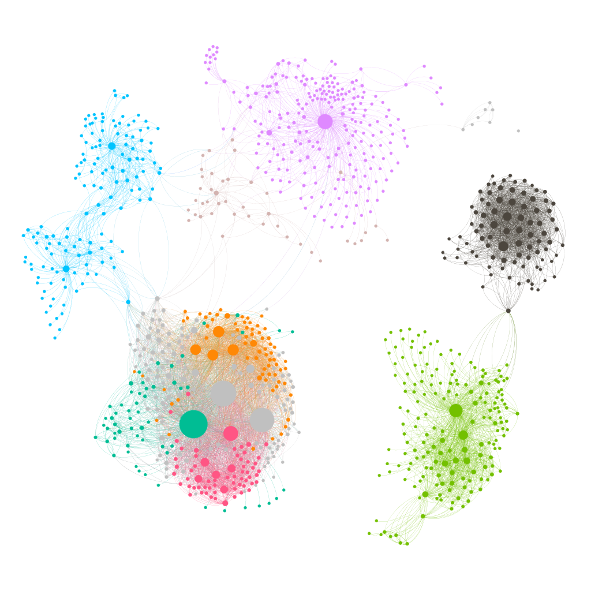

# Training Machines to Learn about Machine Learning
_A neural network language model to show relationships between skills_

### Overview
This project trains a skip-gram Word2vec model in order to make accurate inferences about technical skills. The training data comes from 106,000 job descriptions scraped from the Internet, along with all posts from Stackoverflow with a score greater than 25. The resulting model has many practical uses, including the ability to generate a canonical list of technical skills and the ability to elucidate the relationships between them. Using the same analogy tasks that the original Word2vec paper proposed, the baseline accuracy of this model on a set of 1,954 general language model analogy tasks is 18.17%, and the final model achieved 28.08% accuracy on the same set. However, this paper proposes a novel evaluation method designed specifically for this data and task. The evaluation process involves three steps:
1.  Collecting sentences from Wikipedia from articles about technical skills;
2.  “Corrupting” the sentences by replacing the skill words with randomly selected incorrect skill words; and
3.  Evaluating how likely the model deems the set of correct sentences relative to the corrupted sentences.

**The best-performing model was a skip-gram Word2vec model with a 300 embedding dimensions and a window size of 15. Adjusting window size had the most significant effect on accuracy.**

### Data and Models
- Data can be found here:
- The baseline model and final model (and their associated files) can be found here: http://people.ischool.berkeley.edu/~samuel.goodgame/neural_net_models/

For more detailed information, check out the paper (in this repository).
